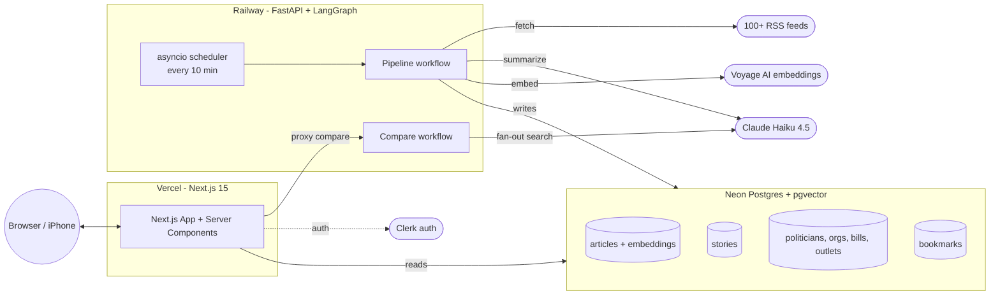

# Sift — How It Works

**Updated:** 2026-05-20
**Audience:** future-me; agents picking up this codebase; you, sketching it on a whiteboard during an interview

The 5-minute version of Sift end-to-end. Read this once; then you can talk about the system without opening the codebase. For depth on any layer, follow the links to the canonical docs.

---

## The product in two sentences

Sift is "the news, with footnotes" — an AI-curated news reader with a civic-literacy layer that adds the context news assumes you already have: an adaptive "what you should know first" primer, inline glossary tooltips, structured dossiers on every politician / organization / bill / outlet, and cross-spectrum framing — all sourced from public records (OpenSecrets, GovTrack, ProPublica, FARA, AllSides, MBFC). Live at [siftnews.kristenmartino.ai](https://siftnews.kristenmartino.ai).

## The architecture in three boxes

Three deployment surfaces, one source of truth:

| Surface | Owns | Repo |
|---|---|---|
| **Vercel** — Next.js 15, App Router, TypeScript | The user-facing reads + UI | `kristenmartino/sift` |
| **Railway** — Python 3.12, FastAPI, LangGraph | The background pipeline + on-demand compare workflow + write path | `kristenmartino/sift-api` |
| **Neon Postgres** with pgvector | All persistent state — articles + embeddings, stories, dossiers, bookmarks | shared |

Plus: Clerk for auth, Sentry for error tracking, Anthropic API for Claude, Voyage AI for embeddings.

## The three user paths through the system

### 1. Browse path — what 99% of traffic does

- Open `siftnews.kristenmartino.ai/news?category=politics`
- Next.js Server Component reads from Postgres (`sift/lib/db.ts` query, partial indexes from `migrations/004_feed_indexes.sql` in sift-api)
- Returns in ~50ms server-side
- Article cards + civic primer panels render

The whole category-browse experience is a database read. **No AI in the request path.**

### 2. Topic search — vector + Claude fallback

- User types a custom topic (e.g. "AI policy in EU healthcare")
- Voyage AI embeds the query (≤ 50ms)
- pgvector cosine similarity against indexed articles
- If ≥ 3 strong matches → stream results via SSE
- If weak matches → fall back to Claude `web_search` for the niche query (~10–15s), stream results as they arrive

### 3. Multi-source compare — the showpiece

- User picks 2–5 outlets + a topic
- Vercel proxies the request to Railway `POST /v1/analyze/compare`
- LangGraph fan-out: parallel Claude `web_search` per outlet (~5–12s each, 20s per-outlet timeout)
- Claim extraction → agreement classification (`unanimous` / `majority` / `disputed` / `unique`)
- Unified claims array returned with source tags

## Why this architecture (the trade-offs to articulate)

| Decision | Trade-off | Why this side |
|---|---|---|
| **AI split by SLA** — pipeline-time for browse, request-time for compare | More complex than "everything live" | Browse is the daily habit (must be 50ms). Compare is the moment-of-need (10–15s is fine). One SLA model can't serve both. |
| **RSS hybrid + Claude summaries** (not Claude search) | RSS feeds can lag breaking news by minutes | RSS gives reliable images, dates, attribution. Claude does only the part it's uniquely good at (summarizing). |
| **Neon Postgres + pgvector** (not Pinecone / Weaviate) | Single-purpose vector DBs are faster at scale | At Sift's scale, pgvector + partial indexes serve all 30 query shapes under 200ms in production. One database to operate, one pool, vector + structured queries in the same `WHERE`. |
| **Two repos, separate deploys** | Two CI pipelines | The frontend ships on its cadence (UI changes daily); the pipeline ships on its (changes weekly). Vercel cold-starts don't touch the slow path; Railway's persistent process is right for LangGraph. |
| **LangGraph** (not bare async, not LangChain monolith) | Adds a workflow framework | Buys: typed state, structured error handling, retry, graph visualization. The pipeline is 5 nodes; compare is 4. Both are easier to reason about as graphs than as nested async functions. |
| **Clerk for auth** (not roll-our-own) | Vendor dependency | Free to 10K MAU. Solves Apple/Google/email sign-in + session + JWT. ~30 min integration vs ~30 hours rolling our own. |
| **Civic data sourced from public records, not Sift's judgment** | Slower content curation, no proprietary scoring | Methodology page is defensible — every claim cites OpenSecrets / FARA / GovTrack / AllSides / MBFC. Sift doesn't compute political lean; it surfaces what published raters say verbatim. |
| **iOS-17+ floor** (forward-looking; in IOS plan, not shipped) | Excludes ~8% of iPhones | Civic-literacy reader user is educated, urban, on newer devices — empirically 96%+. SwiftData + iOS 17 SwiftUI animations are worth the floor. |

## The civic-literacy layer (the differentiator)

What separates Sift from "RSS reader + Claude summary":

- **"What you should know first" primer.** An adaptive panel above each article with the key terms + context the article assumes you already have. AI-generated at ingest time — no live LLM call. Expandable. Persisted as `articles.context_primer` JSONB.
- **Inline glossary chips.** Civic terms surface contextually inside the article body. Tooltip preview on hover, click-through to the full dossier.
- **Civic dossiers.** Politicians, organizations, bills, and outlets each have a structured page:
  - *Politicians* — committee assignments, top PAC industries by contribution, Vote Smart interest-group ratings
  - *Orgs* — type, political lean, funding model, major funders, FARA registration
  - *Bills* — status, sponsor, cosponsors, lobbying-for/against amounts
  - *Outlets* — parent company, AllSides + MBFC ratings, funding model, founding year
- **Cross-spectrum framing.** When multiple outlets covered the same event, Sift shows how each framed it, bucketed by AllSides political lean (left / center / right).
- **Entity linking.** The pipeline's `entity_linker_llm.py` node (LLM-gated, A/B-able) resolves mentions in article text to the curated dossiers. Mid-rollout — see [STATUS.md](../STATUS.md).

## Current state

| Tier | Status | Notes |
|---|---|---|
| **v1** — general-audience aggregator | Shipped March 2026 | Git tag `v1-general-audience`. ~$9/mo to run. |
| **v1.5** — civic-literacy pivot | In flight | 170 new dossier entries seeded May 2026; entity linker fix gated A/B; `/civic` index page operational. See [`docs/plans/`](./plans/). |
| **v2** — native clients | Planned | iOS plan exists but **under review** — see [`docs/IOS_APP_PLAN.md`](./IOS_APP_PLAN.md), [`docs/IOS_APP_ASSESSMENT.md`](./IOS_APP_ASSESSMENT.md). Platform-first call (iOS vs Android vs PWA-only) is open — see [`docs/IOS_VS_ANDROID.md`](./IOS_VS_ANDROID.md). |

## What I'd change if asked at interview

Honest retrospective for whiteboard discussion:

- **Started with `Claude web_search` for both discovery and summarization.** Took two months to learn that's the wrong split — Claude is great at summarization, mediocre at search. Switched to RSS-hybrid in v1.5 dev. Cost: $200+ in burned Claude API spend during the wrong-path period.
- **No instrumentation from day 1.** PostHog wired in retroactively. Means we don't have D30 retention curves for v1. v1.5 is where instrumentation actually lands. Lesson: ship analytics before features, not after.
- **One canonical API would have been right from the start, but only at v2 scale.** The iOS plan flirted with a "canonical `/v1/*`" API in sift-api. The cross-functional assessment correctly pushed back: that's the right move at maturity, not pre-PMF. Initial pre-PMF call: collapse what's already there, not proliferate.
- **Civic-literacy first, not aggregator first.** v1 was a generic aggregator; v1.5 pivots to civic-literacy. In retrospect, the civic angle was always the differentiator. If I were starting over, the primer + dossier surface would be in v1.

## Where to read more

| Question | Doc |
|---|---|
| What's the product vision? | [PRD.md](./PRD.md) |
| What's the founder narrative for it? | [PRODUCT_STORY.md](./PRODUCT_STORY.md) |
| Why did we make X technical choice? | [DECISIONS.md](./DECISIONS.md) (D1–D30 settled) |
| What's currently active? | [`../STATUS.md`](../STATUS.md) |
| What does success look like / current vs target? | [KPIS.md](./KPIS.md) |
| What's planned next? | [PROJECT_PLAN.md](./PROJECT_PLAN.md), [plans/](./plans/) |
| How do the data contracts shape? | [TECHNICAL_SPEC.md](./TECHNICAL_SPEC.md), `lib/types.ts` |
| Where are the feed-query indexes? | `sift-api/migrations/004_feed_indexes.sql` + [sift-api CLAUDE.md](https://github.com/kristenmartino/sift-api/blob/main/CLAUDE.md) |
| Where are the slow queries that serve the feed? | `sift/lib/db.ts` lines 36, 85, 121, 150 |
| iOS plan + critique + platform analysis | [IOS_APP_PLAN.md](./IOS_APP_PLAN.md), [IOS_APP_ASSESSMENT.md](./IOS_APP_ASSESSMENT.md), [IOS_VS_ANDROID.md](./IOS_VS_ANDROID.md) |

## Sister repos

- [`kristenmartino/sift-api`](https://github.com/kristenmartino/sift-api) — Python pipeline + LangGraph compare workflow. Has its own `STATUS.md` + `CLAUDE.md`.
- `kristenmartino/sift-mcp` — MCP server (v0.1 shipped) exposing the compare workflow + hybrid index/web search as MCP tools. Demo target. Separate ship cadence.
- `kristenmartino/portfolio-v2` — case study deploy target at `src/content/work/sift.mdx`.

---

*This doc is the answer to "tell me about a project you built." 30-second version: first three sections. Deep cut: follow the links.*
